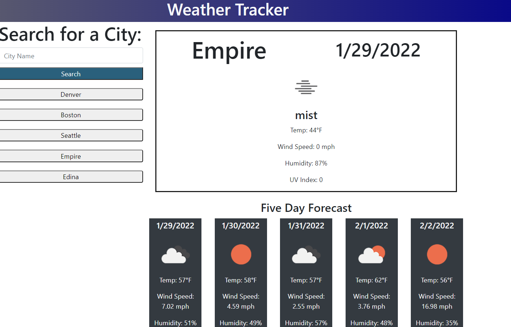

# Weather Tracker

Deployed at [https://nitrotap.github.io/weather-tracker/](https://nitrotap.github.io/weather-tracker/)

Weather Tracker is a simple weather app that shows current conditions and a five-day forecast for any city. Weather Tracker uses OpenWeather's Geolocation and OneCall APIs.

